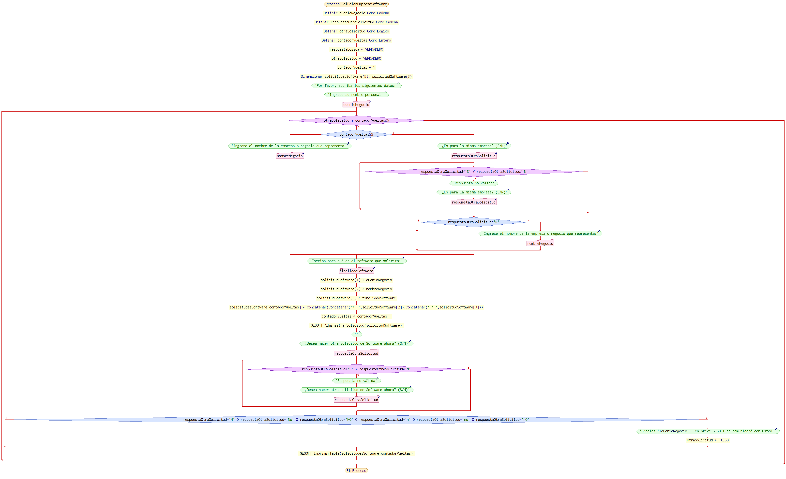

# Trabajo Final - Solución de Software - GESOFT

## Descripción del Proyecto

El presente trabajo es una solución diseñada para una empresa que se dedica a la venta de software tanto a negocios como a usuarios finales. El objetivo principal de esta solución es simplificar y optimizar el proceso de solicitud y gestión de proyectos de software por parte de los clientes.

## Logo

[Ver el archivo](./documentation/Selección%20del%20logo.md) Markdown que relata los pasos que se dieron para seleccionar el logotipo ideal que hoy define a la empresa.

## Funcionalidades Principales

El proyecto consta de las siguientes funcionalidades principales:

1. **Captura de Datos del Negocio y Finalidad del Software**: El sistema permite a los clientes proporcionar información sobre su negocio y los requisitos específicos del software que necesitan. Esta información se recopila en una solicitud única.

2. **Envío de Solicitud a GESOFT**: Una vez que se han recopilado los datos del negocio y la finalidad del software, el sistema envía esta información como una solicitud a GESOFT, la empresa encargada de administrar el flujo de trabajo a partir de la recepción de la solicitud.

3. **Consulta de Base de Datos de Solicitudes**: El proyecto también incluye una extensión que permite consultar una base de datos de solicitudes previamente registradas. Esta base de datos almacena información como el nombre del solicitante, el estado del proyecto solicitado, el número de solicitud y la fecha de recepción de la solicitud.

## Contenido del Repositorio

En este repositorio GitHub, encontrarás la siguiente documentación y recursos relacionados con el proyecto:

- **Diagrama de Flujo General**: Se proporciona un diagrama de flujo que representa el proceso general de cómo funciona la solución, desde la captura de datos hasta la gestión de la solicitud por parte de GESOFT.

- **Diagrama de Flujo Función Administrar**: En esta imagen se muestra el flujo de trabajo de la función "Administrar solicitud" en la solución, que abarca la gestión de solicitudes de software, la comunicación con GESOFT y otros procesos relacionados.

- **Diagrama de Flujo Función Imprimir**: En esta imagen se representa la lógica de la función "Imprimir tabla" en la solución. Esta función se encarga de generar y presentar la tabla de solicitudes con los datos relevantes, como el número de solicitud, el nombre del negocio y detalles de la solicitud.

- **Pseudocódigo**: Se incluye un pseudocódigo que simula el sistema de solicitudes de software. Este pseudocódigo proporciona una visión detallada de cómo se procesan las solicitudes.

- **Teoría sobre la Gestión de Proyectos**: Se presenta teoría relacionada con la gestión de proyectos, incluyendo las metodologías que se han aplicado en este proyecto introductorio. [Ver el archivo](./assets/Teoría%20sobre%20la%20Gestión.md)

## Repositorio GitHub

Puede acceder a toda la documentación y recursos relacionados con este proyecto: [Ver repositorio del Trabajo Final](https://github.com/GuilloSGit/TPFinalFullcoders)

## Contribuciones y Contacto

Si deseas contribuir al proyecto o tienes alguna pregunta o comentario, no dude en ponerse en contacto conmigo a través de las siguientes vías:

- Correo Electrónico: [guillermoandrada@gmail.com](mailto:guillermoandrada@gmail.com)
- GitHub: [GuilloSGit en GitHub](https://github.com/GuilloSGit)

Agradezco el interés en el proyecto y espero que esta solución sea lo suficientemente buena para aprobar el curso.

¡Gracias por la atención!
