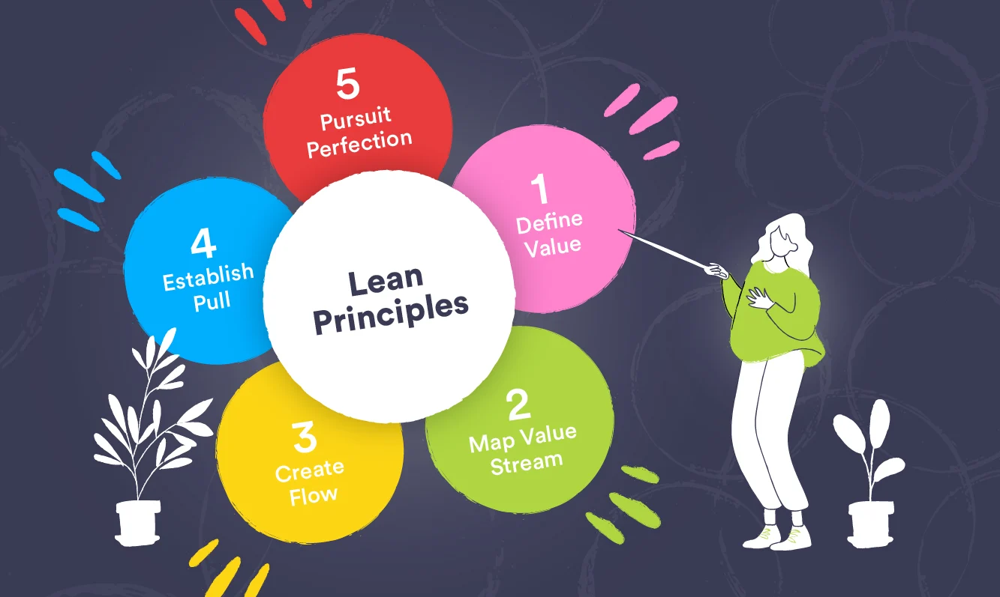

# Teoría sobre la Gestión de Proyectos

Lograr aplicar la metodología ágil LEAN en un proyecto de forma independiente puede ser un desafío gratificante. En mi experiencia, llevar a cabo un proyecto siguiendo los principios de LEAN me permitió maximizar la eficiencia y la calidad, a pesar de trabajar de manera individual.

Aquí comparto cómo logré aplicar la metodología LEAN en mi proyecto de forma exitosa.

**1. Comprender los Principios LEAN:**
Antes de comenzar mi proyecto, me sumergí en el estudio de los principios fundamentales de LEAN. Esto incluyó la eliminación de desperdicio, la optimización de procesos y la búsqueda constante de la eficiencia. Estos conceptos se convirtieron en mi guía a lo largo de todo el proyecto.

**2. Definir el Valor para el Cliente:**
El primer paso en LEAN es identificar el valor que el proyecto aportará al cliente. En mi caso, esto significaba tener una comprensión clara de los objetivos y requisitos del proyecto antes de avanzar. Esto me ayudó a mantenerme enfocado en lo que realmente importaba.

**3. Eliminar Desperdicio:**
LEAN se centra en eliminar todo tipo de desperdicio, ya sea de tiempo, recursos o esfuerzo. Para lograrlo, examiné de cerca mis procesos de trabajo y eliminé cualquier actividad que no aportara valor real al proyecto. Esto me permitió concentrarme en las tareas esenciales.

**4. Flujo de Valor Continuo:**
Implementé un flujo de trabajo continuo y optimizado. Utilicé herramientas de gestión de proyectos y colaboración en línea para mantener un seguimiento constante del progreso. Esto facilitó la identificación temprana de problemas y la toma de decisiones ágiles.

**5. Mejora Continua:**
LEAN promueve la mejora constante. A lo largo del proyecto, revisé regularmente mis procesos y resultados. Siempre estuve abierto a adaptar y ajustar en función de los aprendizajes y las nuevas circunstancias.

**6. Enfoque en la Calidad:**
La calidad es un pilar fundamental de LEAN. Me aseguré de que cada paso del proyecto se llevara a cabo con un alto nivel de calidad y que las entregas cumplieran con los estándares establecidos.

**7. Colaboración y Comunicación:**
Aunque trabajaba de forma independiente, no dejé de lado la comunicación y la colaboración. Mantuve una comunicación constante con cualquier persona involucrada en el proyecto, como stakeholders o usuarios finales, para garantizar que sus necesidades se tuvieran en cuenta.

**8. Resultados Exitosos:**
Al aplicar la metodología LEAN de manera diligente, logré completar el proyecto de manera eficiente y con resultados exitosos. La eliminación de desperdicio y el enfoque en la calidad se tradujeron en un producto final que satisfizo las expectativas de los usuarios y las partes interesadas.

Aplicar la metodología ágil LEAN de manera individual en mi proyecto fue un proceso de aprendizaje enriquecedor. Esta experiencia me ha convencido de la efectividad de LEAN, no solo en proyectos empresariales, sino también en proyectos personales y profesionales.
